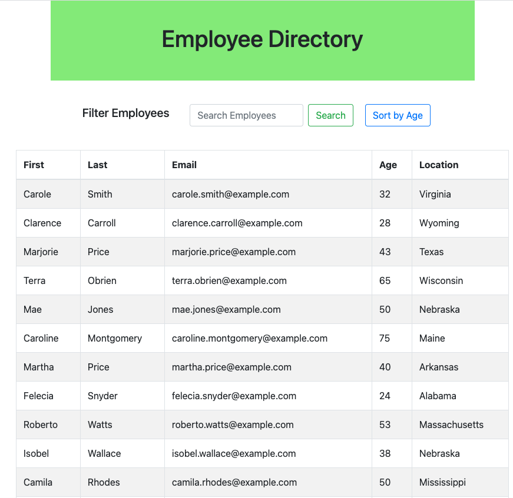

# Employee Yellow Pages

<span align="left">

<a href="https://img.shields.io/badge/License-MIT-brightgreen?style=plastic"></a>

 </span>
 
## Description

An employee directory application that allows users to sort employees by a category with the use of React.

View the deployed application [here](https://dsmooke.github.io/employee-yellow-pages/)



# Table of Contents

- [Description](#description)
- [Technologies Used](#tech-used)
- [MVC Structure](#folder-structure)
- [Instructions](#instructions)
- [Goals](#goals)
- [User Story](#user-story)
- [Acceptance Criteria](#acceptance-criteria)
- [Installation](#installation)
- [Bugs](#bugs)
- [Credits](#credits)
- [Contact](#contact)
- [License](#license)

## Technologies Used

- Node
- React
- Axios
- [Random User API]("https://randomuser.me/")

### MVC Structure

```

.
├── public
|   ├──index.html
|   └──manifest.webmanifest
│   └── assets
│       ├── css
│           └── style.css
│       └── imgs
│           └── imgs.png
|
├── src
|   ├── App.js
|   ├── index.js
│   └── components
│           ├── Container.js
│           |   └── style.css
|           |
|           ├── EmployeeCard.js
│           |   └── style.css
│           |
│           └── Filter.js
│               └── style.css
│
├── node_modules
|
├── package.json
|
├── package-lock.json
|
└──.gitignore

```

## Instructions

To create an employee directory with React which will require you to break up your application's UI into components, manage component state, and respond to user events.

## Goals

1. Break up the application's UI into small reusable components
2. Manage the components' state
3. Respond to user events:
   - The user should be able to sort the table by at least one category.
   - The user should be able to filter the users by at least one property.
4. Deploy the site to GitHub Pages using the [Create React App docs for deployment]("https://create-react-app.dev/docs/deployment/#github-pages")

- **NOTE**: Be sure to push your codebase to GitHub and **NOT** your build and deployed code. Follow the above instructions and use `gh-pages` branch to host the deployed application's code.

## User Story

```
AS A USER
I WANT to be able to view my entire employee directory at once
SO THAT I have quick access to their information.
```

## Business Context

An employee or manager would benefit greatly from being able to view non-sensitive data about other employees. It would be particularly helpful to be able to filter employees by name.

## Acceptance Criteria

```
GIVEN a table of random users generated from the Random User API
WHEN the user loads the page
THEN a table of employees should render.
```

## Installation

- Clone repo and install packages. Edit scripts within package.json file. `npm start` to run in integrated terminal, run in browser with localhost:3000.

### Bugs

As of March 23, 2021: doesn't filter users, nor does it sort by age. handleInputChange has issues. Refer to inline bookmarks denoted by @ audit-issue. Not deployed with GitHub pages because it appeared to delete the contents of my main branch.

Personal note: burnt out, need to buy books that introduce React in a step-by-step fashion instead of cross-referencing blog posts and Google.

## Credits

[Create React App docs for deployment]("https://create-react-app.dev/docs/deployment/#github-pages")

## Contact

[Dana Smooke]("https://github.com/dsmooke")

## License

[MIT]("https://opensource.org/licenses/MIT")

---

© 2021 Trilogy Education Services, LLC, a 2U, Inc. brand. Confidential and Proprietary. All Rights Reserved.
